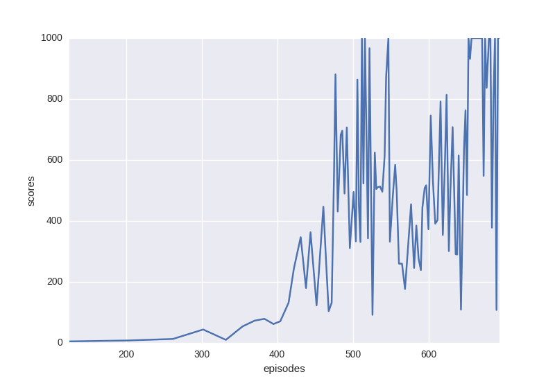
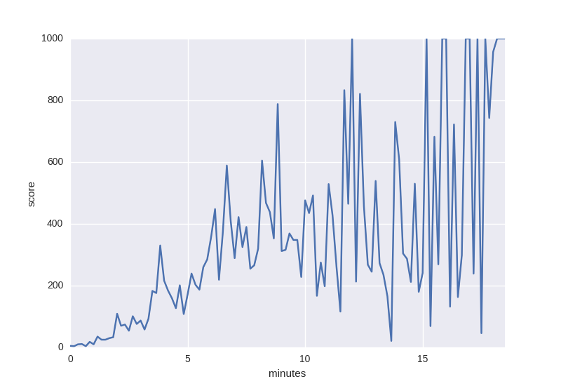

# Pytorch-DPPO

## Acknowledge
[alexis-jacq/Pytorch-DPPO](https://github.com/alexis-jacq/Pytorch-DPPO)

## Citation
```
@article{DBLP:journals/corr/SchulmanWDRK17,
  author    = {John Schulman and
               Filip Wolski and
               Prafulla Dhariwal and
               Alec Radford and
               Oleg Klimov},
  title     = {Proximal Policy Optimization Algorithms},
  journal   = {CoRR},
  volume    = {abs/1707.06347},
  year      = {2017},
  url       = {http://arxiv.org/abs/1707.06347},
  timestamp = {Sat, 05 Aug 2017 14:56:06 +0200},
  biburl    = {http://dblp.uni-trier.de/rec/bib/journals/corr/SchulmanWDRK17},
  bibsource = {dblp computer science bibliography, http://dblp.org}
}

@article{DBLP:journals/corr/HeessTSLMWTEWER17,
  author    = {Nicolas Heess and
               Dhruva TB and
               Srinivasan Sriram and
               Jay Lemmon and
               Josh Merel and
               Greg Wayne and
               Yuval Tassa and
               Tom Erez and
               Ziyu Wang and
               S. M. Ali Eslami and
               Martin A. Riedmiller and
               David Silver},
  title     = {Emergence of Locomotion Behaviours in Rich Environments},
  journal   = {CoRR},
  volume    = {abs/1707.02286},
  year      = {2017},
  url       = {http://arxiv.org/abs/1707.02286},
  timestamp = {Tue, 08 Aug 2017 15:06:57 +0200},
  biburl    = {http://dblp.uni-trier.de/rec/bib/journals/corr/HeessTSLMWTEWER17},
  bibsource = {dblp computer science bibliography, http://dblp.org}
}
```

## About
Pytorch implementation of Distributed Proximal Policy Optimization: https://arxiv.org/abs/1707.02286
Using PPO with clip loss (from https://arxiv.org/pdf/1707.06347.pdf).

Progress of single PPO with InvertedPendulum-v1:


Progress of DPPO (4 agents) with InvertedPendulum-v1:


## Acknowledgments
The structure of this code is based on https://github.com/ikostrikov/pytorch-a3c.

Hyperparameters and loss computation has been taken from https://github.com/openai/baselines
